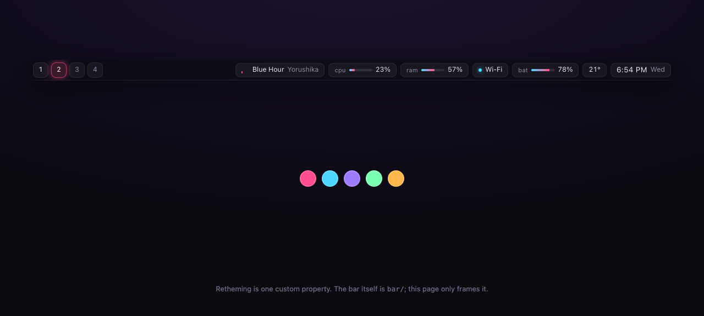
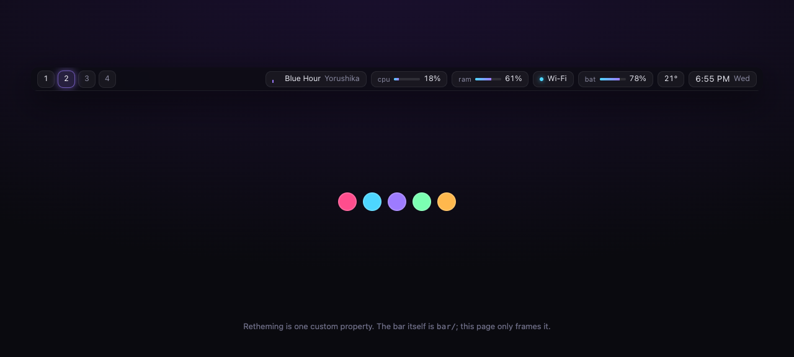

# neon-bar

A status bar for [Zebar](https://github.com/glzr-io/zebar) on Windows. Dark, one accent
colour, and everything on it is live.



Workspaces from GlazeWM, now playing, CPU and memory meters, network, battery, temperature
and a clock. Click a workspace to focus it.

## Try it

**[rlawoals0529.github.io/neon-bar](https://rlawoals0529.github.io/neon-bar/)** - a live preview of the bar

## Retheming is one line

Every colour on the bar derives from `--accent`, so changing the whole thing means changing
one custom property.



```css
:root { --accent: #9d7bff; }
```

## Install

Requires [Zebar](https://github.com/glzr-io/zebar), and [GlazeWM](https://github.com/glzr-io/glazewm)
if you want the workspace buttons to do anything.

```
git clone https://github.com/rlawoals0529/neon-bar %userprofile%\.glzr\zebar\neon-bar
```

Then start it from the Zebar tray icon. `zpack.json` places it top-centre, full width, 38px,
on every monitor.

## Preview it in a browser

The interesting half of a status bar is how it looks, and iterating on that should not need
Windows, a window manager and a running Zebar.

```bash
npx http-server -p 8080 .
# open http://localhost:8080/preview/
```

The preview frames the real bar in an iframe and feeds it mocked provider output - drifting
CPU and memory, a rotating track, a running clock. The colour swatches under it retheme the
live bar.

## How it is put together

```
bar/render.js    render(state) - a pure function of a plain object
bar/bar.js       binds Zebar's providers onto that object
bar/style.css    every colour derived from --accent
preview/mock.js  the same object, generated locally
```

`render()` never imports `zebar`. That is what lets the same files run under Zebar on
Windows and in any browser, and it is why the layout can be worked on without the
window manager.

`bar.js` tries to import `zebar` and falls back to the mock when it is not there, so
opening `bar/index.html` directly works too.

## Providers used

`glazewm` · `media` · `cpu` · `memory` · `network` · `battery` · `weather` · `date`

No API keys. Zebar's weather provider resolves location and forecast on its own.

## Status

The layout, theming and update loop are verified in a browser against the mock. **The Zebar
provider binding in `bar.js` has not been run against a live Zebar install** - it follows
the documented `createProviderGroup` API, but field names may need adjusting on first run.
If something reads empty, that mapping in `fromZebar()` is the place to look.

MIT
