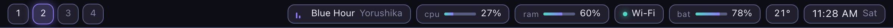
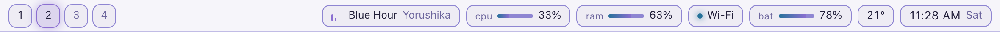

# neon-bar

A status bar for [Zebar](https://github.com/glzr-io/zebar) on Windows. One accent colour,
fifteen palettes, and everything on it is live.



Workspaces from GlazeWM, now playing, CPU and memory meters, network, battery, temperature
and a clock. Click a workspace to focus it.

## Try it

**[rlawoals0529.github.io/neon-bar](https://rlawoals0529.github.io/neon-bar/)** - the real bar,
in a frame, on any of the fifteen.

## Fifteen palettes, one attribute

Colours come from [yozora](https://github.com/rlawoals0529/yozora), vendored into `theme/`.
Every palette is one stylesheet scoped to `[data-theme]`, so switching is one attribute write
and needs no build step - which matters, because Zebar loads `bar/` off disk unbundled.



```html
<html lang="en" data-theme="wisteria-alley">
```

## Why the bar is opaque

It used to be 82% over the desktop, with a backdrop blur. That was wrong, and finding out
how wrong is the most interesting thing in this repo.

A palette computes its contrast guarantees against an opaque background. A bar does not have
one: it floats over a wallpaper nobody who wrote it has seen, so what a colour is really read
against is `alpha x background + (1 - alpha) x whatever is behind`. Every guarantee in the
palette file is void for anything painted there.

The first version of [`scripts/bar-alpha.mjs`](scripts/bar-alpha.mjs) checked white and black
and signed it off. That is the wrong check: contrast against a fixed colour is V-shaped in the
other colour's luminance, bottoming out where the two **meet** rather than at either extreme.
Sweeping every grey instead:

| bar opacity | worst wallpaper, on Rain Lantern |
| --- | --- |
| 100% | 3.01:1 |
| 95% | 2.69:1 |
| 90% | 2.33:1 |
| **82%, as shipped** | **1.77:1** |
| 70% | 1.13:1 |

against the 3:1 WCAG asks of a boundary. All fifteen palettes solve to fully opaque, because
yozora tunes its outline token to just above 3:1 on its own background and there is no
headroom left to spend on a desktop.

Text is safe for a separate reason, and it is a design decision rather than a number: every
readout sits inside an opaque chip, which puts it back under the palette's own guarantees
whatever is behind the bar. [`e2e/contrast.spec.ts`](e2e/contrast.spec.ts) holds both - the
solved opacity against what the browser actually paints, and the no-translucent-ancestor rule
for every piece of text - across all fifteen palettes over a white and a black desktop.

## Install

Requires [Zebar](https://github.com/glzr-io/zebar), and [GlazeWM](https://github.com/glzr-io/glazewm)
if you want the workspace buttons to do anything.

```
git clone https://github.com/rlawoals0529/neon-bar %userprofile%\.glzr\zebar\neon-bar
```

Then start it from the Zebar tray icon. `zpack.json` places it top-centre, full width, 38px,
on every monitor. Change the palette by editing `data-theme` in `bar/index.html`, or by
adding `?theme=sakura-lake` to the `htmlPath`.

No build step is needed to run it. Everything under `bar/` is plain JavaScript and plain CSS
for exactly that reason.

## Develop

```bash
npm install
npm run dev      # http://localhost:4188/preview/
npm run check    # build, unit tests, browser tests
npm run alpha    # re-solve theme/bar-alpha.css
npm run shots    # re-shoot the screenshots above
```

## How it is put together

```
bar/render.js      render(state) - a pure function of a plain object
bar/bar.js         binds Zebar's providers onto that object
bar/theme.js       reads ?theme=, and refuses an id no stylesheet defines
bar/style.css      shape and light; every colour is a token
theme/             vendored from yozora - do not edit, re-run its vendor.mjs
theme/bar-alpha.css  generated by scripts/bar-alpha.mjs
preview/main.ts    the picker, on yozora's own store and key handling
preview/mock.js    the same state object, generated locally
```

`render()` never imports `zebar`. That is what lets the same files run under Zebar on Windows
and in any browser, and it is why the layout can be worked on without the window manager.
`bar.js` tries to import `zebar` and falls back to the mock when it is not there, so opening
`bar/index.html` directly works too.

The preview page is TypeScript and does have a build, because it uses yozora's theme store and
its palette key handling rather than a fifth hand-rolled copy of both. The bar does not use
either: it has no scrollbars for `color-scheme` to steer and no picker of its own.

## Providers used

`glazewm` · `media` · `cpu` · `memory` · `network` · `battery` · `weather` · `date`

No API keys. Zebar's weather provider resolves location and forecast on its own.

## Status

Layout, theming, contrast and the update loop are verified in a browser against the mock.
**The Zebar provider binding in `bar.js` has not been run against a live Zebar install** - it
follows the documented `createProviderGroup` API, but field names may need adjusting on first
run. If something reads empty, `fromZebar()` is the place to look.

MIT
